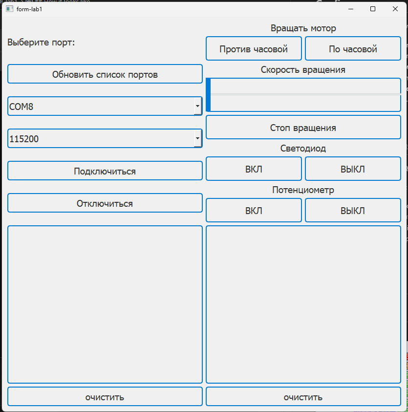
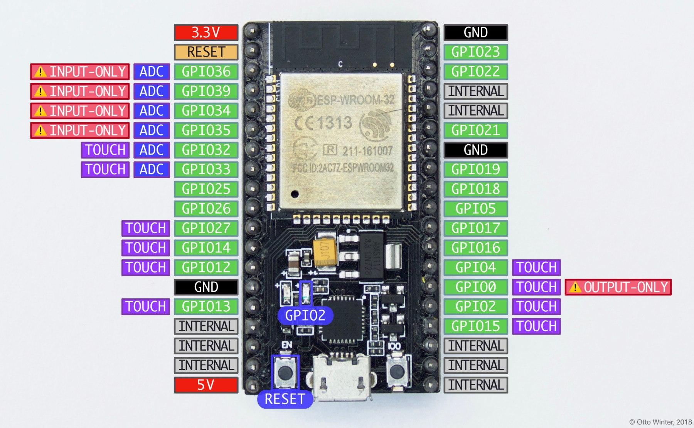
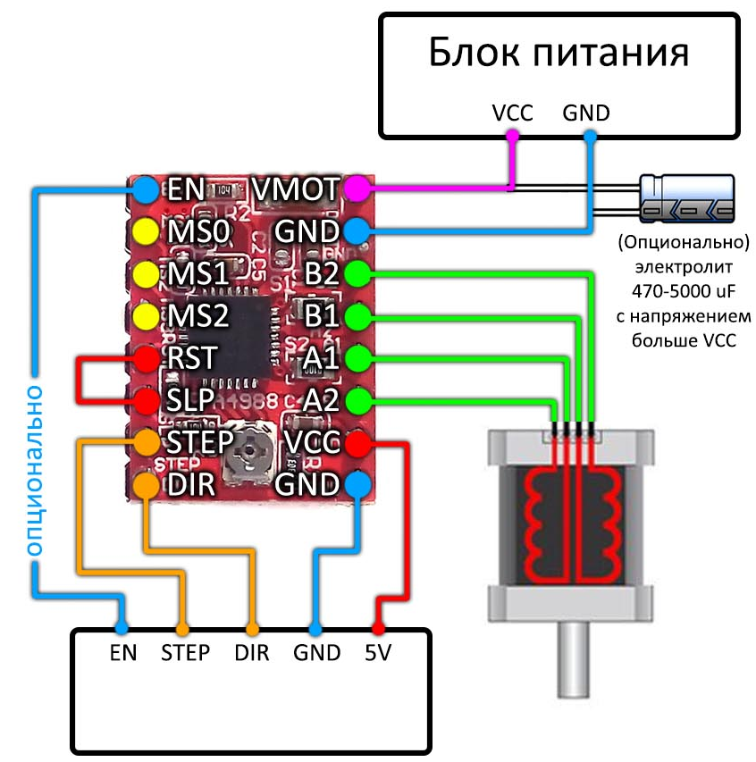

# DaGOI_lab1
Repository for the academic subject "Designing a graphical operator interface" (DaGOI). 1st year 1 semester of the master's program "Unmanned robotics and Ergonomics" of Moscow Polytechnic University. Laboratory work 1.

## Configure
Project was written on windows...

1. Downland python to somethere: https://www.python.org/downloads/release/python-3100/
2. To use pip and python in windows terminal need to configure Environment variables in windows. Open "Свойства системы (win -> Изменение системных переменных среды)" -> "Переменные среды". Here will be some environment variables. Create or change or add to **PATH** variable text: **C:\Program Files\Python310\Scripts;C:\Program Files\Python310**. Just paths to to python and python scripts from libs... After this you can use pip and python scripts doesnt metter where.
3. pip install serial
4. pip install PyQt5

## Whats instrument used

For creating .ui file was used Qt Designer.

For creating .exe file was used:
1. pip install auto-py-to-exe
2. Checking: python -m auto_py_to_exe --version
3. Next open the terminal in the folder with the .py scripts: python -m auto_py_to_exe py file
4. Specify the path to the py file. specify in additional files .ui interface
5. Convert
6. Win

## How it looks like

## Aditional info
NodeMCU ESP32 pinout

A4988 pinout and connection. Thanks for https://alexgyver.ru/gyverstepper/

Motor stepper 17HS4401 with driver A4988. Logic signal 5v. Power supply for driver ac/dc adaptor input 100-240V-50/60Hz, output dc12v 3a